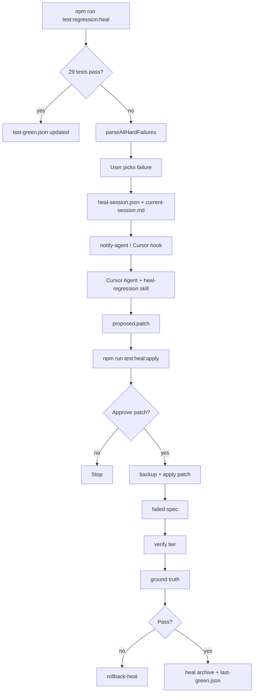
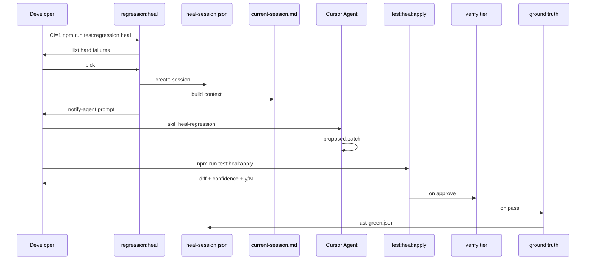

# Self-healing regression loop — V2

V2 builds on V1 without rewriting the Playwright regression suite. V1 flow is replaced; artifacts and safety rules are preserved.

See also: `docs/heal-loop.md` (V1 reference), `docs/skills/heal-regression/SKILL.md`.

---

## Architecture



---

## Sequence (happy path)



---

## State machine

| State | Entry | Exit |
|-------|-------|------|
| `idle` | — | regression:heal starts |
| `regression_running` | heal entry | pass → baseline / fail → parse |
| `pick_failure` | hard failures > 0 | user picks one |
| `session_ready` | heal-session + current-session written | agent produces patch |
| `patch_ready` | proposed.patch has diff | test:heal:apply |
| `awaiting_approval` | apply shows diff | y → apply / n → stop |
| `low_confidence_gate` | confidence < 70 | second y/N |
| `applying` | backup + git apply | spec re-run |
| `verifying` | verify tier | pass → ground truth |
| `ground_truth` | full regression | pass → done / fail → rollback |
| `rolled_back` | verify or GT failed | manual fix |

---

## Commands

| Command | Purpose |
|---------|---------|
| `CI=1 npm run test:regression:heal` | Full regression → pick failure → session + agent context |
| `npm run test:heal:apply` | Apply patch, verify, ground truth, rollback on fail |
| `npm run test:heal` | Alias for `test:heal:apply` |
| `npm run test:heal:verify` | Fast tier only |
| `npm run test:heal:ground-truth` | Full 29 + `last-green.json` (no reporter override) |
| `npm run test:heal:notify` | Re-print agent prompt |
| `npm run test:heal:rollback` | Manual restore from `backup/` |

---

## heal-session.json schema (V2)

```json
{
  "version": 2,
  "session_id": "2026-06-17-1200-regression-multi-medicine",
  "failed_spec": "tests/regression/multi-medicine.spec.ts",
  "failed_test_title": "Walk-in consultation → …",
  "classification": "ui-change",
  "confidence": 88,
  "confidence_tier": "medium",
  "recommended_action": "heal-test",
  "trace_path": "test-results/heal/latest/trace.zip",
  "screenshot_paths": ["test-results/heal/latest/before.png"],
  "last_green_path": "test-results/last-green.json",
  "last_green": {},
  "portal_commits_since_last_green": ["abc1234 Fix meds label"],
  "timestamp": "ISO-8601",
  "regression_failure_count": 2,
  "proposed_patch_path": "docs/heal-sessions/<id>/proposed.patch",
  "session_dir": "docs/heal-sessions/<id>",
  "allowed_edit_roots": ["tests/"],
  "hard_rules": [],
  "failure_error": "..."
}
```

TypeScript types: `scripts/heal/types.ts`.

---

## Confidence model

| Score | Tier | Typical cases | Apply gate |
|-------|------|---------------|------------|
| ≥ 95 | high | Blocker overlay, click intercept, locator rename | Single y/N |
| 70–94 | medium | Dropdown structure, module moved | Single y/N |
| < 70 | low | API, assertion, business logic | **Second** y/N + warning |

Heuristic in `scripts/heal/classify-failure.mjs` — always confirm manually.

---

## Failure classifications

| Label | Heal tests? | Action |
|-------|-------------|--------|
| `ui-change` | Yes (with approval) | Page objects, blockers, locators |
| `bug` | No (document) | Fix portal |
| `env` | No | `test:setup`, fix overlay/JWT |
| `flaky` | Excluded from pick list | Not in hard-failure picker |

---

## Approval workflow

1. **Regression** fails → user **picks** one hard failure
2. **Agent** proposes patch → writes `proposed.patch` (does not apply)
3. **Terminal** `test:heal:apply` shows diff + classification + confidence
4. If confidence < 70 → **second** prompt
5. **Apply** → backup → `git apply` / `patch`
6. **Verify** → **ground truth**
7. On failure → **rollback** only files in patch → `rollback-<timestamp>.md`

---

## Artifacts

| Path | Purpose |
|------|---------|
| `test-results/heal/latest/heal-session.json` | V2 session record |
| `docs/heal-sessions/current-session.md` | Ephemeral agent brief |
| `docs/heal-sessions/<id>/proposed.patch` | Unified diff from Agent |
| `test-results/heal/latest/backup/` | Pre-apply file snapshot |
| `docs/heal-sessions/heal-<id>.md` | Permanent archive on success |
| `docs/heal-sessions/rollback-<ts>.md` | Rollback record |

---

## Cursor hooks (local)

Hooks live in **`ai-testing-poc/.cursor/`** (where the heal skill lives). Optional — keep local until you choose to push.

- `hooks.json` → `afterFileEdit` → `on-heal-session.sh`
- `run-regression-heal` always runs `notify-agent.mjs` as fallback

`chmod +x .cursor/hooks/on-heal-session.sh`

---

## Safety rules (unchanged)

- One failure at a time
- Never auto-commit / push / merge
- Never edit `Pm-Doctor-Portal` in heal loop
- Never increase failure count — rollback on regression
- Assertions only with explicit approval + documented rule change

---

## Scripts layout

```
scripts/heal/
├── types.ts                 # Schema types (reference)
├── classify-failure.mjs     # Numeric confidence
├── create-heal-session.mjs  # heal-session.json
├── build-heal-context.mjs   # current-session.md
├── apply-heal.mjs           # Apply + verify + GT + rollback
├── verify-heal.mjs
├── update-baseline.mjs      # Ground truth (baseline reporter fix)
├── rollback-heal.mjs
├── notify-agent.mjs
├── bundle.mjs               # parseAllHardFailures
└── lib.mjs
```

---

## V1 → V2 changes

| V1 | V2 |
|----|-----|
| First failure only | User picks hard failure |
| Manual "use skill heal-regression" | `current-session.md` + notify + hook |
| `test:heal` resume without apply | `test:heal:apply` applies patch |
| String confidence | Numeric 0–100 + tier |
| `--reporter=list` broke baseline | Ground truth uses config reporters only |
| Pilot scope warning | Any of 29 specs healable |
